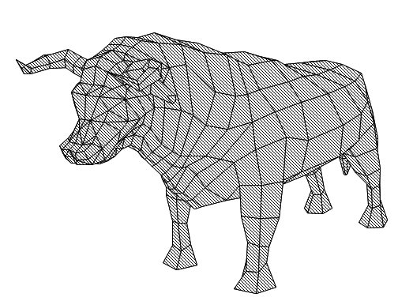

# Painter Algorithm

Dixit Wikipedia:\
The painter's algorithm (also depth-sort algorithm and priority fill) is an algorithm for visible surface determination in 3D computer graphics that works on a polygon-by-polygon basis rather than a pixel-by-pixel, row by row, or area by area basis of other Hidden-Surface Removal algorithms. The algorithm can fail in some cases, including cyclic overlap or piercing polygons.

The rendering is made in GDI+ using the ```FillPolygon``` function.\
3D Projection are made using OpenGL Mathematics (GLM).


